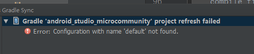

* * *

### 流水
1. 1024入职日；
2. 入职手续，资料完成；
3. 电脑配备E450 ThinkPad；
4. 软件开发环境配置：
> [x]JDK安装ok；
> [x]Android Studio安装ok；
> []Android Studio配置插件no.ok；

5. 工号：120921
6. SVN账号/VPN账号/gitlab账号OK/个人邮箱账号OK；[链接文件](E:\Chenley\Acount\Ejushanghai.txt)
7. SVN资源`checkout`/实惠APP代码`checkout` -ing
8. 常用软件安装：SourceTree/Foxmail/Chrome/FOXITPDF/WPS/SVN...
9. gitlab 拉取失败问题，提示没有权限
> 愿意：URL地址提供选择了SSH的形式导致无法`checkout`；
> 解决：使用http地址+gitlab的用户名和密码可以`checkout`；

10. 上班时间：995（目前）；
11. AS加载项目遇到问题

	问题在于对其他lib project的引用问题？？如何解决？